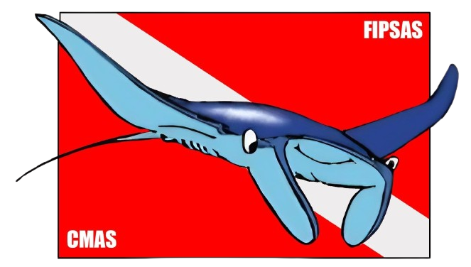

  

<h1 align="center">Asti Blu Subacquea</h1>

  Sito ufficiale dell'associazione subacquea Asti Blu — corsi, apnea, agonismo e viaggi. 
  <a href="https://www.astiblu.it">www.astiblu.it</a>

---

## Stack

- HTML / CSS / JavaScript statico
- PHP — form contatti (reCAPTCHA v3) + pannello admin
- Apache `.htaccess` — HTTPS, sicurezza, caching
- JSON — contenuti gestibili dal pannello admin
- GitHub Actions → FTP deploy automatico su Aruba

## Deploy

Ogni push su `main` avvia il deploy automatico via FTP su Aruba.  
I file sensibili (`contact-config.php`, `.htpasswd`, `oauth.php`) non vengono mai committati.

## Admin

Pannello di gestione testi disponibile su `/admin/` (accesso con password).
